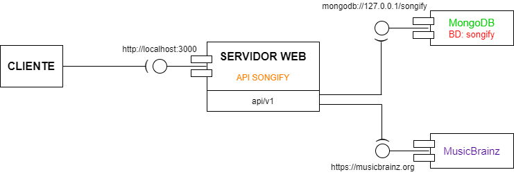

# **Servicio web REST Songify**

## Miembros del proyecto
María Calvo, Cristina Balsalobre, Gema Patricia Herrera y Ramón Merchán.

## ¿Qué es Songify?
Songify es un servicio web cuyo objetivo es proporcionar información de temática musical. Los clientes que se conecten a la API podrán realizar consultas HTTP para obtener registros de artistas, canciones y álbumes de música.

Los clientes pueden hacer operaciones CRUD y recibir la información en XML o JSON dependiendo de los recursos solicitados. Las operaciones y recursos disponibles están definidos en `songifyApi/schema/OpenAPI.yaml`.

Este proyecto proporciona tanto el servidor web como un ejemplo de cliente para conectarse y realizar peticiones, más adelante se explica su [despliegue y ejecución](#item1).

## Requisitos para su ejecución
Es necesario tener instaladas las herramientas de `Node.js`,  la base de datos `MongoDB` y una shell para ejecutar el servidor.

## Arquitectura
Se expone la arquitectura que existe cuando un cliente se conecta a la API de Songify:
- El servidor web REST (API Songify) se ejecuta en **local** y escucha por el **puerto 3000** y dispone el recurso **/api/v1** para procesar peticiones.

- El cliente realiza peticiones HTTP a la API Songify con la ruta: 
`http://localhost:3000/api/v1/<recurso_solicitado>`.

- La API Songify trata la petición y encuentra el recurso accediendo a la **base de datos MongoDB cuyo nombre es songify**, o a la **API MusicBrainz** (https://musicbrainz.org/doc/About). A continuación envía como respuesta al cliente el recurso obtenido.

  

## Preparación del entorno
### Instalación de Node.js
Descargue e instale la versión LTS más actualizada de Node.js del siguiente link: https://nodejs.org/en/

Compruebe que lo ha instalado correctamente, en la shell escriba:
~~~
>node --version
~~~
Y debería haber obtenido una versión igual o superior a la siguiente salida por consola:
~~~
v16.18.0
~~~

### Instalación de MongoDB
Se recomienda la instalación de la interfaz gráfica `MongoDB Compass` si no se está familiarizado con los comandos de consola. Se puede descargar del siguiente link escogiendo la versión más estable y el sistema operativo en uso: https://www.mongodb.com/try/download/compass.

### Creación y carga de datos en base de datos
Se siguen los siguientes pasos:
1. Ejecutar MongoDB Compass.

2. Conectarse al puerto por defecto (generalmente es `mongodb://localhost:27017`).

3. En el apartado `databases` pulsar `+`para crear una BD, introduciendo `songify` como nombre de la BD y `artist` como colección.

4. En el listado de bases de datos, pulsar `+` para añadir una nueva colección cuyo nombre debe ser `release`. 

5. En la colección **artist** pulsar en `ADD DATA` e importar el archivo `songifyAPI/data/artists.json` para añadir datos de artistas.

6. En la colección **release** pulsar en `ADD DATA` e importar el archivo `songifyAPI/data/releases.json` para añadir los datos de álbumes.

### Instalación de dependencias
Antes de arrancar el servidor es necesario instalarse las dependencias que utiliza el proyecto. En una shell se debe ejecutar el siguiente comando en la ruta `/songifyAPI` para que instale automáticamente las dependencias utilizadas:

~~~
>npm install
~~~

## Despliegue y ejecución

### Servidor Web
Para ejecutar el programa, abra una shell, y dentro de la raíz del proyecto (ruta: `/songifyAPI`), ejecute el siguiente comando:

~~~
>npm start
~~~

Si la ejecución es satisfactoria, se deberá recibir el siguiente mensaje:

~~~
> songifyapi@0.0.0 start
> node ./bin/www        

mongodb://127.0.0.1/songify
Succesfully connected to database
~~~

Según reciba peticiones HTTP del lado del cliente, aparecerán por el terminal los mensajes de log asociados a las respuestas que enviará el servidor.

### Cliente
Se propone la ejecución de un cliente desarrollado en Songify para conectarse y probar la API, aunque otro cliente o herramienta que esté en la misma red local que el servidor web Songify, también puede conectarse al introducir las rutas adecuadas en sus peticiones HTTP. A continuación se explicará cómo ejecutar el cliente desarrollado en `sogifyAPI/client/client.js`.

Es imprescindible que **el servidor esté en ejecución antes que cualquier cliente se conecte a la API**.

Para ejecutar el cliente proporcionado en este proyecto, se debe abrir una terminal en la ruta `sogifyAPI/client` y ejecutar el archivo `client.js` con el siguiente comando:

~~~
>node client.js
~~~

A continuación el cliente pide que el usuario introduzca el tipo de petición HTTP que se desea realizar y la ruta del recurso que se quiere obtener. En caso de que se requiera introducir un JSON para realizar las peticiones, el cliente habilita un espacio para que el usuario lo proporcione. Las consultas y recursos posibles que puede realizar el cliente están definidos en `songifyApi/schema/OpenAPI.yaml`.

Se expone un ejemplo de utilización del cliente en el que se hace un PUT donde se modifican los parámetros *{"country": "ARG", "language": "esp"}* del álbum *6475e6566dbac3e0ab6776a8* del artista *6475e6416dbac3e0ab676d4d* :

~~~
Enter the HTTP method (GET, DELETE, PUT, or POST), or type "exit" to quit: PUT
Enter the URL: http://localhost:3000/api/v1/artist/6475e6416dbac3e0ab676d4d/release/6475e6566dbac3e0ab6776a8
Enter the JSON payload: {"country": "ARG", "language": "esp"}
Response (JSON): {
  acknowledged: true,
  modifiedCount: 0,
  upsertedId: null,
  upsertedCount: 0,
  matchedCount: 1
}
~~~

Cabe destacar que para el correcto funcionamiento del cliente y el servidor, es necesario que el cliente introduzca correcta y exactamente los parámetros que se piden por pantalla y utilizar solamente las rutas definidas en  `songifyApi/schema/OpenAPI.yaml`.

 

Mayo de 2023

